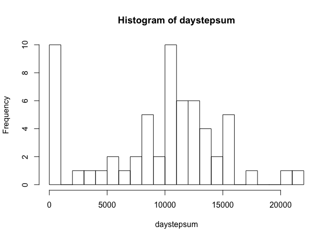
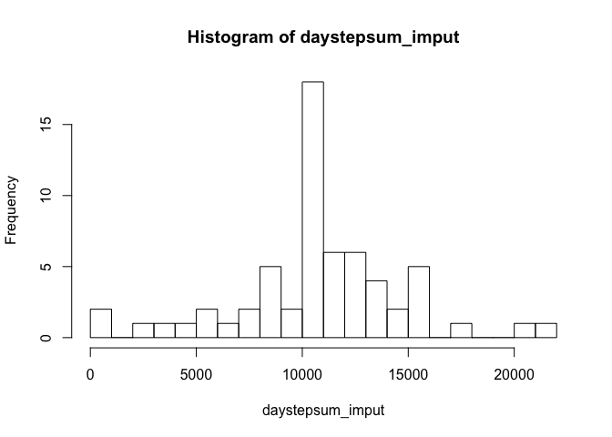

# Reproducible Research: Peer Assessment 1

Completed by Haifeng Yu on 2017-04-15

## Introduction
This assignment makes use of data from a personal activity monitoring device. This device collects data at 5 minute intervals through out the day. The data consists of two months of data from an anonymous individual collected during the months of October and November, 2012 and include the number of steps taken in 5 minute intervals each day.

Before analysing, I have downloaded and unzipped the data file "activity.csv" into the current working directory.

## Loading and preprocessing the data

*1. Load the data*


```r
activity <- read.csv("activity.csv")
```

*2. Process/transform the data (if necessary) into a format suitable for your analysis*

First look at the structure of the dataset:


```r
str(activity)
```

```
## 'data.frame':	17568 obs. of  3 variables:
##  $ steps   : int  NA NA NA NA NA NA NA NA NA NA ...
##  $ date    : Factor w/ 61 levels "2012-10-01","2012-10-02",..: 1 1 1 1 1 1 1 1 1 1 ...
##  $ interval: int  0 5 10 15 20 25 30 35 40 45 ...
```

So the dataset has 3 variables, **steps** and **interval** are stored as integer, and **date** is stored as factor. I will keep them "as is" and transform when needed in the following analysis. 

## What is mean total number of steps taken per day?

*1. Calculate the total number of steps taken per day and make a histogram of the total number of steps taken each day*

Store the total number of steps taken per day in the variable **daystepsum**, ignoring NA values.


```r
daystepsum <- with(activity, tapply(steps, date, sum, na.rm = TRUE))
hist(daystepsum, breaks = 20)
```

<!-- -->

*2. Calculate and report the **mean** and **median** total number of steps taken per day*

```r
mean(daystepsum)
```

```
## [1] 9354.23
```

```r
median(daystepsum)
```

```
## [1] 10395
```
## What is the average daily activity pattern?

*1. Make a time series plot of the 5-minute interval (x-axis) and the average number of steps taken, averaged across all days (y-axis)*

Create variable **intstepmean** as the average number of steps taken in each interval, ignoring NA values.

Here I transformed **interval** to factor for tapply function.

Then create data matrix **intplot** and plot the result as a time series plot.


```r
intstepmean <- with(activity, tapply(steps, as.factor(interval), mean, na.rm = TRUE))
intplot <- cbind(as.integer(names(intstepmean)), intstepmean)
plot(intplot[,1], intplot[,2], type = "l", xlab = "Interval", ylab = "Average Steps")
```

<!-- -->

*2. Which 5-minute interval, on average across all the days in the dataset, contains the maximum number of steps?*

Using which.max to find the maximum number of mean steps:


```r
intstepmean[which.max(intstepmean)]
```

```
##      835 
## 206.1698
```

According to the result, the interval **"835"** indicates the interval of 08:35 has the maximum number of steps, with an average step of **206.1698**.

## Imputing missing values
*1. Calculate and report the total number of missing values in the dataset*

```r
sum (is.na(activity$steps))
```

```
## [1] 2304
```
*2. Devise a strategy for filling in all of the missing values in the dataset. The strategy does not need to be sophisticated. For example, you could use the mean/median for that day, or the mean for that 5-minute interval, etc.*

This and the next requirements are achieved below together.

*3. Create a new dataset that is equal to the original dataset but with the missing data filled in.*

Create a new dataset **activlty_imput** to add the imputed missing data. Then fill the **steps** value with the average steps of that 5-min interval if the original data was NA


```r
activity_imput <- activity
for (i in 1:length(activity_imput$steps)) {
        if (is.na(activity_imput$steps[i])) {
                activity_imput$steps[i] <- intstepmean[as.character(activity_imput$interval[i])]
        } 
}
```
*4. Make a histogram of the total number of steps taken each day and Calculate and report the **mean** and **median** total number of steps taken per day. Do these values differ from the estimates from the first part of the assignment? What is the impact of imputing missing data on the estimates of the total daily number of steps?*

With the imputed data, store the total number of steps taken per day in the variable **daystepsum_imput**


```r
daystepsum_imput <- with(activity_imput, tapply(steps, date, sum))
hist(daystepsum_imput, breaks = 20)
```

<!-- -->

Report the mean and median of the imputed data

```r
mean(daystepsum_imput)
```

```
## [1] 10766.19
```

```r
median(daystepsum_imput)
```

```
## [1] 10766.19
```

Because of the strategy, NA that counted as 0 were all changed to the mean of that interval. There were **2304** NA values and that impacted the mean and median numbers a lot. We can see how the centre and the left column of these two histograms changed. It may indicate that the strategy I used was not the best one to imput this dataset.

## Are there differences in activity patterns between weekdays and weekends?

*1. Create a new factor variable in the dataset with two levels -- "weekday" and "weekend" indicating whether a given date is a weekday or weekend day.*

Add the new variable **day** in the **activity_imput** dataset indicating if the data is on a weekday or a weekend

```r
wknd <- c("Saturday", "Sunday")
activity_imput$day = as.factor(ifelse(is.element(weekdays(as.POSIXct(activity_imput$date)),wknd), "Weekend", "Weekday"))
```
*2. Make a panel plot containing a time series plot of the 5-minute interval (x-axis) and the average number of steps taken, averaged across all weekday days or weekend days (y-axis). The plot should look something like the example*

Aggregate the dataset into **x**, look at **x** and assign variable names to it accordingly. Then use xyplot command in lattice package to draw the plot like the example.


```r
x <- aggregate(activity_imput$steps, by = list(activity_imput$interval, activity_imput$day), mean )
head(x)
```

```
##   Group.1 Group.2          x
## 1       0 Weekday 2.25115304
## 2       5 Weekday 0.44528302
## 3      10 Weekday 0.17316562
## 4      15 Weekday 0.19790356
## 5      20 Weekday 0.09895178
## 6      25 Weekday 1.59035639
```

```r
names(x) <- c("interval", "day", "avgsteps")
head(x)
```

```
##   interval     day   avgsteps
## 1        0 Weekday 2.25115304
## 2        5 Weekday 0.44528302
## 3       10 Weekday 0.17316562
## 4       15 Weekday 0.19790356
## 5       20 Weekday 0.09895178
## 6       25 Weekday 1.59035639
```

```r
library(lattice)
xyplot(avgsteps ~ interval | day, data = x, type = "l", layout = c(1,2), xlab = "Interval", ylab = "Number of steps")
```

<!-- -->
